# Contract Card Service Notifications

- **Diagram Type**: Logical
- **Package**: HomerSelect/BSL/Modules/Contract Services (COS)/Interface Provided/Generated messages/Contract Service Notifications
- **Diagram ID**: 158646
- **Elements**: 11
- **Connectors**: 10

```mermaid
classDiagram
    class ADD_ContractServiceRole["{ADD}ContractServiceRole"]
    class OperationStatusType["OperationStatusType"]
    class RelatedTransaction["RelatedTransaction"]
    class ContractCardServiceReplacedNotification["ContractCardServiceReplacedNotification"]
    class ContractCardServiceReplacedRollbackNotification["ContractCardServiceReplacedRollbackNotification"]
    class ContractCardServiceCreatedNotification["ContractCardServiceCreatedNotification"]
    class ContractCardServiceCanceledNotification["ContractCardServiceCanceledNotification"]
    class ContractCardServiceTerminatedNotification["ContractCardServiceTerminatedNotification"]
    class ContractCardServiceActivatedNotification["ContractCardServiceActivatedNotification"]
    class ContractServiceNotification["ContractServiceNotification"]
    class ContractCardServiceNotification["ContractCardServiceNotification"]
    ContractServiceNotification ..> ADD_ContractServiceRole : unnamed
    ContractServiceNotification ..> OperationStatusType : unnamed
    ContractServiceNotification ..> RelatedTransaction : unnamed
    ContractCardServiceNotification <|-- ContractCardServiceReplacedNotification : unnamed
    ContractCardServiceNotification <|-- ContractCardServiceReplacedRollbackNotification : unnamed
    ContractCardServiceNotification <|-- ContractCardServiceCreatedNotification : unnamed
    ContractCardServiceNotification <|-- ContractCardServiceCanceledNotification : unnamed
    ContractCardServiceNotification <|-- ContractCardServiceTerminatedNotification : unnamed
    ContractCardServiceNotification <|-- ContractCardServiceActivatedNotification : unnamed
    ContractServiceNotification <|-- ContractCardServiceNotification : unnamed
```

