# Contract Service Notifications

- **Diagram Type**: Logical
- **Package**: HomerSelect/BSL/Modules/Contract Services (COS)/Interface Provided/Generated messages/Contract Service Notifications
- **Diagram ID**: 158645
- **Elements**: 17
- **Connectors**: 16

```mermaid
classDiagram
    class ADD_ContractServiceRole["{ADD}ContractServiceRole"]
    class ContractServiceReplacedRollbackNotification["ContractServiceReplacedRollbackNotification "]
    class OperationStatusType["OperationStatusType"]
    class ContractInsuranceServiceOperStatusChangedNotification["ContractInsuranceServiceOperStatusChangedNotification"]
    class ContractServiceOperStatusChangedNotification["ContractServiceOperStatusChangedNotification"]
    class RelatedTransaction["RelatedTransaction"]
    class ContractInsuranceServiceCreatedNotification["ContractInsuranceServiceCreatedNotification "]
    class ContractServiceCreatedNotification["ContractServiceCreatedNotification"]
    class ContractServiceReplacedNotification["ContractServiceReplacedNotification"]
    class ContractInsuranceServiceNotification["ContractInsuranceServiceNotification"]
    class ContractServiceCanceledNotification["ContractServiceCanceledNotification"]
    class ContractInsuranceServiceCanceledNotification["ContractInsuranceServiceCanceledNotification"]
    class ContractServiceTerminatedNotification["ContractServiceTerminatedNotification"]
    class ContractInsuranceServiceTerminatedNotification["ContractInsuranceServiceTerminatedNotification"]
    class ContractServiceActivatedNotification["ContractServiceActivatedNotification"]
    class ContractInsuranceServiceActivatedNotification["ContractInsuranceServiceActivatedNotification"]
    class ContractServiceNotification["ContractServiceNotification"]
    ContractServiceNotification <|-- ContractServiceOperStatusChangedNotification : unnamed
    ContractServiceNotification ..> RelatedTransaction : unnamed
    ContractInsuranceServiceNotification <|-- ContractInsuranceServiceTerminatedNotification : unnamed
    ContractInsuranceServiceNotification <|-- ContractInsuranceServiceActivatedNotification : unnamed
    ContractInsuranceServiceNotification <|-- ContractInsuranceServiceCreatedNotification : unnamed
    ContractInsuranceServiceNotification <|-- ContractInsuranceServiceOperStatusChangedNotification : unnamed
    ContractServiceNotification ..> OperationStatusType : unnamed
    ContractServiceNotification <|-- ContractServiceCanceledNotification : unnamed
    ContractServiceNotification ..> ADD_ContractServiceRole : unnamed
    ContractServiceNotification <|-- ContractServiceCreatedNotification : unnamed
    ContractServiceNotification <|-- ContractServiceReplacedNotification : unnamed
    ContractServiceNotification <|-- ContractServiceReplacedRollbackNotification : unnamed
    ContractServiceNotification <|-- ContractInsuranceServiceNotification : unnamed
    ContractServiceNotification <|-- ContractServiceTerminatedNotification : unnamed
    ContractServiceNotification <|-- ContractServiceActivatedNotification : unnamed
    ContractInsuranceServiceNotification <|-- ContractInsuranceServiceCanceledNotification : unnamed
```

