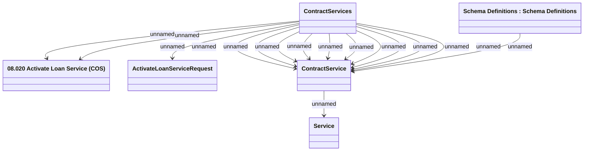

# Activate Loan Service method (COS)

```mermaid
classDiagram
    class Service["Service"]
    class Schema_Definitions_Schema_Definitions["Schema Definitions : Schema Definitions"]
    class ContractService["ContractService"]
    class ActivateLoanServiceRequest["ActivateLoanServiceRequest"]
    class ContractServices["ContractServices"]
    class n_08_020_Activate_Loan_Service_COS["08.020 Activate Loan Service (COS)"]
    ContractServices --> n_08_020_Activate_Loan_Service_COS : unnamed
    ContractServices --> n_08_020_Activate_Loan_Service_COS : unnamed
    ContractServices --> ActivateLoanServiceRequest : unnamed
    ContractServices --> ContractService : unnamed
    ContractServices --> ContractService : unnamed
    ContractServices --> ContractService : unnamed
    ContractServices --> ContractService : unnamed
    ContractServices --> ContractService : unnamed
    ContractServices --> ContractService : unnamed
    ContractServices --> ContractService : unnamed
    Schema_Definitions_Schema_Definitions --> ContractService : unnamed
    ContractServices --> ContractService : unnamed
    ContractServices --> ContractService : unnamed
    ContractServices --> ContractService : unnamed
    ContractService --> Service : unnamed
```
