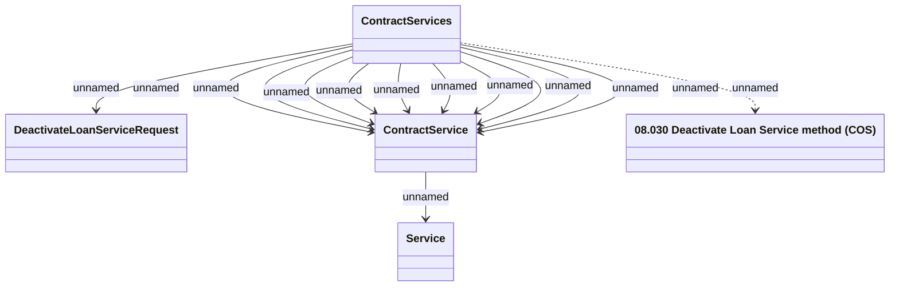

# Deactivate Contract Services method (COS)

- **Diagram Type**: Logical
- **Package**: HomerSelect/BSL/Modules/Contract Services (COS)/Interface Provided/Web Services/Contract Services
- **Diagram ID**: 159906
- **Elements**: 5
- **Connectors**: 13

