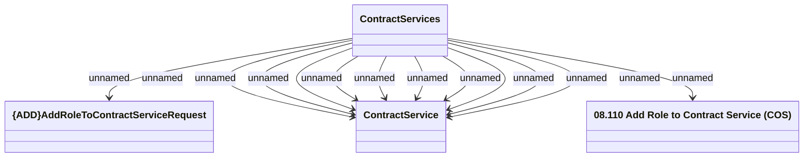

# {ADD}Add Role to Contract Services method

```mermaid
classDiagram
    class n_08_110_Add_Role_to_Contract_Service_COS["08.110 Add Role to Contract Service (COS)"]
    class ContractService["ContractService"]
    class ContractServices["ContractServices"]
    class ADD_AddRoleToContractServiceRequest["{ADD}AddRoleToContractServiceRequest"]
    ContractServices --> ADD_AddRoleToContractServiceRequest : unnamed
    ContractServices --> ContractService : unnamed
    ContractServices --> ContractService : unnamed
    ContractServices --> ContractService : unnamed
    ContractServices --> ContractService : unnamed
    ContractServices --> ContractService : unnamed
    ContractServices --> ContractService : unnamed
    ContractServices --> ContractService : unnamed
    ContractServices --> ContractService : unnamed
    ContractServices --> ContractService : unnamed
    ContractServices --> ContractService : unnamed
    ContractServices --> n_08_110_Add_Role_to_Contract_Service_COS : unnamed
```
