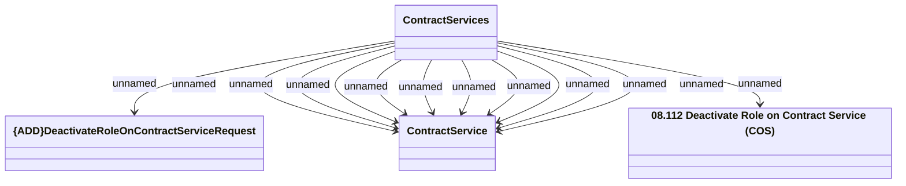

# {ADD}Deactivate Role on Contract Services method

- **Diagram Type**: Logical
- **Package**: HomerSelect/BSL/Modules/Contract Services (COS)/Interface Provided/Web Services/Contract Services
- **Diagram ID**: 159912
- **Elements**: 4
- **Connectors**: 12

