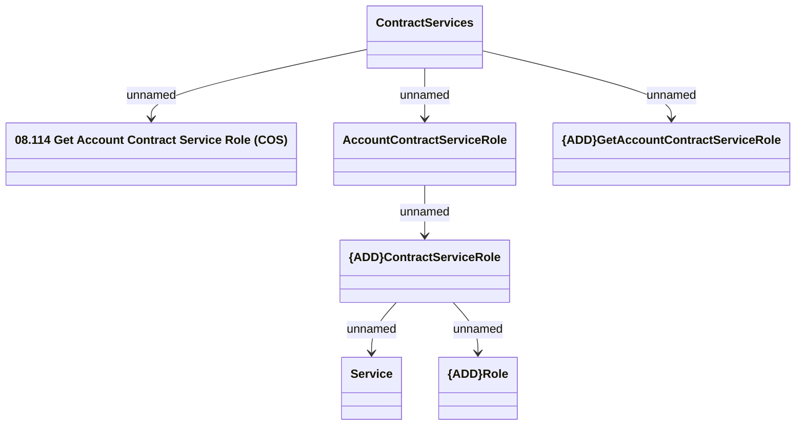

# {ADD}Get Account Contract Service Roles (COS)

- **Diagram Type**: Logical
- **Package**: HomerSelect/BSL/Modules/Contract Services (COS)/Interface Provided/Web Services/Contract Services
- **Diagram ID**: 159913
- **Elements**: 7
- **Connectors**: 6

