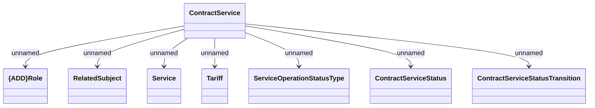

# Schema Definitions

- **Diagram Type**: Logical
- **Package**: HomerSelect/BSL/Modules/Contract Services (COS)/Interface Provided/Web Services/Contract Services/Schema Definitions
- **Diagram ID**: 157307
- **Elements**: 8
- **Connectors**: 7

