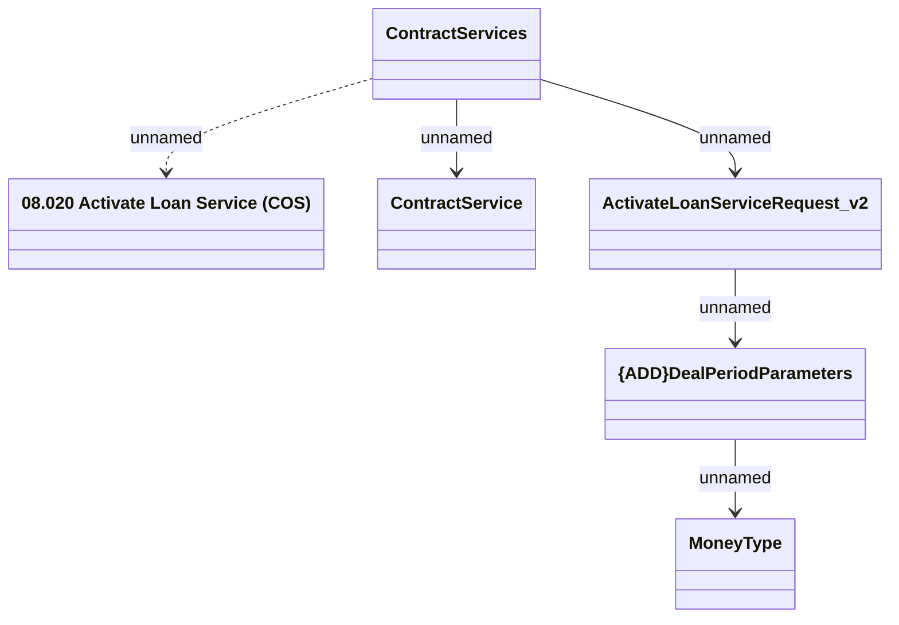

# Activate Loan Service method (COS) v2

- **Diagram Type**: Logical
- **Package**: HomerSelect/BSL/Modules/Contract Services (COS)/Interface Provided/Web Services/Contract Services/v2
- **Diagram ID**: 159071
- **Elements**: 6
- **Connectors**: 5

