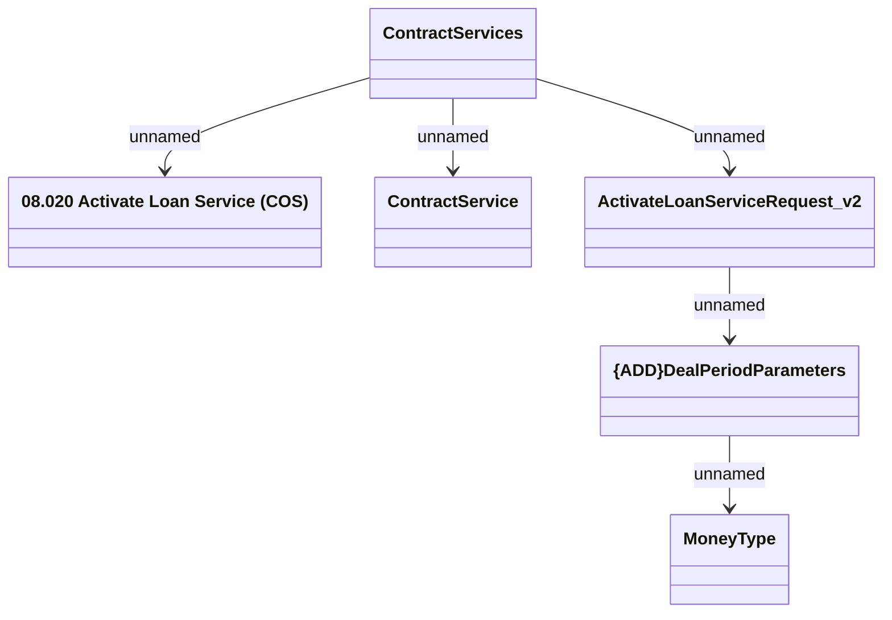

# Activate Loan Service method (COS) v2

```mermaid
classDiagram
    class MoneyType["MoneyType"]
    class n_08_020_Activate_Loan_Service_COS["08.020 Activate Loan Service (COS)"]
    class ContractService["ContractService"]
    class ActivateLoanServiceRequest_v2["ActivateLoanServiceRequest_v2"]
    class ADD_DealPeriodParameters["{ADD}DealPeriodParameters"]
    class ContractServices["ContractServices"]
    ContractServices --> n_08_020_Activate_Loan_Service_COS : unnamed
    ADD_DealPeriodParameters --> MoneyType : unnamed
    ActivateLoanServiceRequest_v2 --> ADD_DealPeriodParameters : unnamed
    ContractServices --> ActivateLoanServiceRequest_v2 : unnamed
    ContractServices --> ContractService : unnamed
```
