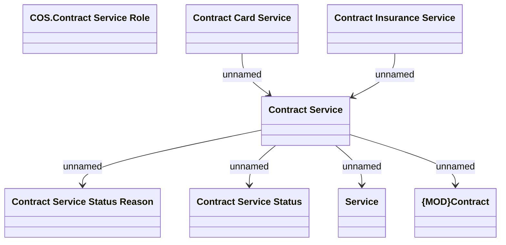

# COS - LDM changes

```mermaid
classDiagram
    class COS_Contract_Service_Role["COS.Contract Service Role"]
    class Contract_Card_Service["Contract Card Service"]
    class Contract_Insurance_Service["Contract Insurance Service"]
    class Service["Service"]
    class Contract_Service["Contract Service"]
    class MOD_Contract["{MOD}Contract"]
    class Contract_Service_Status["Contract Service Status"]
    class Contract_Service_Status_Reason["Contract Service Status Reason"]
    Contract_Card_Service --> Contract_Service : unnamed
    Contract_Service --> Contract_Service_Status_Reason : unnamed
    Contract_Service --> Contract_Service_Status : unnamed
    Contract_Insurance_Service --> Contract_Service : unnamed
    Contract_Service --> Service : unnamed
    Contract_Service --> MOD_Contract : unnamed
```
