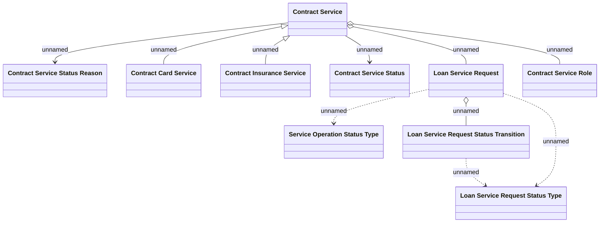

# Logical Data Model

- **Diagram Type**: Logical
- **Package**: HomerSelect/BSL/Modules/Contract Services (COS_NG)/Analytical Model/Logical Data Model
- **Diagram ID**: 163454
- **Elements**: 10
- **Connectors**: 10

