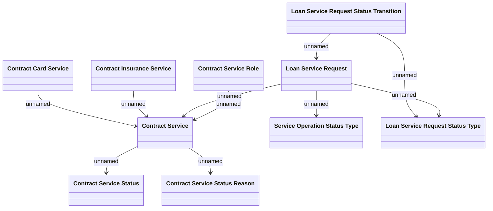

# Logical Data Model

```mermaid
classDiagram
    class Contract_Service_Status_Reason["Contract Service Status Reason"]
    class Contract_Card_Service["Contract Card Service"]
    class Contract_Insurance_Service["Contract Insurance Service"]
    class Contract_Service_Status["Contract Service Status"]
    class Contract_Service["Contract Service"]
    class Service_Operation_Status_Type["Service Operation Status Type"]
    class Loan_Service_Request_Status_Transition["Loan Service Request Status Transition"]
    class Loan_Service_Request_Status_Type["Loan Service Request Status Type"]
    class Loan_Service_Request["Loan Service Request"]
    class Contract_Service_Role["Contract Service Role"]
    Loan_Service_Request_Status_Transition --> Loan_Service_Request : unnamed
    Loan_Service_Request_Status_Transition --> Loan_Service_Request_Status_Type : unnamed
    Loan_Service_Request --> Loan_Service_Request_Status_Type : unnamed
    Loan_Service_Request --> Service_Operation_Status_Type : unnamed
    Contract_Card_Service --> Contract_Service : unnamed
    Contract_Insurance_Service --> Contract_Service : unnamed
    Loan_Service_Request --> Contract_Service : unnamed
    Contract_Service_Role --> Contract_Service : unnamed
    Contract_Service --> Contract_Service_Status : unnamed
    Contract_Service --> Contract_Service_Status_Reason : unnamed
```
