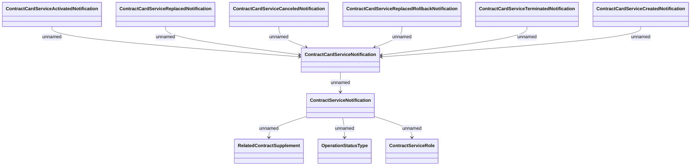

# Contract Card Service Notifications

```mermaid
classDiagram
    class ContractServiceRole["ContractServiceRole"]
    class OperationStatusType["OperationStatusType"]
    class RelatedContractSupplement["RelatedContractSupplement"]
    class ContractCardServiceReplacedNotification["ContractCardServiceReplacedNotification"]
    class ContractCardServiceReplacedRollbackNotification["ContractCardServiceReplacedRollbackNotification"]
    class ContractCardServiceCreatedNotification["ContractCardServiceCreatedNotification"]
    class ContractCardServiceCanceledNotification["ContractCardServiceCanceledNotification"]
    class ContractCardServiceTerminatedNotification["ContractCardServiceTerminatedNotification"]
    class ContractCardServiceActivatedNotification["ContractCardServiceActivatedNotification"]
    class ContractServiceNotification["ContractServiceNotification"]
    class ContractCardServiceNotification["ContractCardServiceNotification"]
    ContractCardServiceNotification --> ContractServiceNotification : unnamed
    ContractCardServiceActivatedNotification --> ContractCardServiceNotification : unnamed
    ContractCardServiceReplacedNotification --> ContractCardServiceNotification : unnamed
    ContractCardServiceCanceledNotification --> ContractCardServiceNotification : unnamed
    ContractCardServiceReplacedRollbackNotification --> ContractCardServiceNotification : unnamed
    ContractCardServiceTerminatedNotification --> ContractCardServiceNotification : unnamed
    ContractCardServiceCreatedNotification --> ContractCardServiceNotification : unnamed
    ContractServiceNotification --> RelatedContractSupplement : unnamed
    ContractServiceNotification --> OperationStatusType : unnamed
    ContractServiceNotification --> ContractServiceRole : unnamed
```
