# Contract Service Notifications

- **Diagram Type**: Logical
- **Package**: HomerSelect/BSL/Modules/Contract Services (COS_NG)/Interface Provided/Generated messages/Contract Service Notifications v1
- **Diagram ID**: 160497
- **Elements**: 21
- **Connectors**: 21

```mermaid
classDiagram
    class ServiceParameter["ServiceParameter"]
    class FinancialParameter["FinancialParameter"]
    class Deal["Deal"]
    class Tariff["Tariff"]
    class Service["Service"]
    class ContractServiceRole["ContractServiceRole"]
    class ContractServiceReplacedRollbackNotification["ContractServiceReplacedRollbackNotification "]
    class OperationStatusType["OperationStatusType"]
    class ContractInsuranceServiceOperStatusChangedNotification["ContractInsuranceServiceOperStatusChangedNotification"]
    class ContractServiceOperStatusChangedNotification["ContractServiceOperStatusChangedNotification"]
    class RelatedContractSupplement["RelatedContractSupplement"]
    class ContractInsuranceServiceCreatedNotification["ContractInsuranceServiceCreatedNotification "]
    class ContractServiceCreatedNotification["ContractServiceCreatedNotification"]
    class ContractServiceReplacedNotification["ContractServiceReplacedNotification"]
    class ContractServiceCanceledNotification["ContractServiceCanceledNotification"]
    class ContractInsuranceServiceCanceledNotification["ContractInsuranceServiceCanceledNotification"]
    class ContractServiceTerminatedNotification["ContractServiceTerminatedNotification"]
    class ContractInsuranceServiceTerminatedNotification["ContractInsuranceServiceTerminatedNotification"]
    class ContractServiceActivatedNotification["ContractServiceActivatedNotification"]
    class ContractInsuranceServiceActivatedNotification["ContractInsuranceServiceActivatedNotification"]
    class ContractServiceNotification["ContractServiceNotification"]
    ContractServiceNotification ..> ContractServiceRole : unnamed
    ContractServiceNotification ..> OperationStatusType : unnamed
    ContractServiceNotification ..> RelatedContractSupplement : unnamed
    ContractServiceNotification --> Deal : unnamed
    ContractServiceNotification --> Service : unnamed
    ContractServiceNotification ..> Tariff : unnamed
    ContractServiceNotification --> Service : unnamed
    ContractServiceNotification <|-- ContractServiceActivatedNotification : unnamed
    ContractServiceNotification <|-- ContractInsuranceServiceCreatedNotification : unnamed
    ContractServiceNotification <|-- ContractServiceReplacedNotification : unnamed
    ContractServiceNotification <|-- ContractServiceCanceledNotification : unnamed
    ContractServiceNotification <|-- ContractInsuranceServiceActivatedNotification : unnamed
    ContractServiceNotification <|-- ContractServiceOperStatusChangedNotification : unnamed
    ContractServiceNotification <|-- ContractInsuranceServiceOperStatusChangedNotification : unnamed
    ContractServiceNotification <|-- ContractServiceReplacedRollbackNotification : unnamed
    ContractServiceNotification <|-- ContractInsuranceServiceTerminatedNotification : unnamed
    ContractServiceNotification <|-- ContractServiceCreatedNotification : unnamed
    ContractServiceNotification <|-- ContractServiceTerminatedNotification : unnamed
    ContractServiceNotification <|-- ContractInsuranceServiceCanceledNotification : unnamed
    ContractServiceNotification --> ServiceParameter : unnamed
    ContractServiceNotification --> FinancialParameter : unnamed
```

