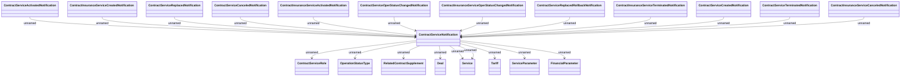

# Contract Service Notifications

```mermaid
classDiagram
    class Deal["Deal"]
    class Tariff["Tariff"]
    class Service["Service"]
    class ContractServiceRole["ContractServiceRole"]
    class ContractServiceReplacedRollbackNotification["ContractServiceReplacedRollbackNotification "]
    class OperationStatusType["OperationStatusType"]
    class ContractInsuranceServiceOperStatusChangedNotification["ContractInsuranceServiceOperStatusChangedNotification"]
    class ContractServiceOperStatusChangedNotification["ContractServiceOperStatusChangedNotification"]
    class RelatedContractSupplement["RelatedContractSupplement"]
    class ContractInsuranceServiceCreatedNotification["ContractInsuranceServiceCreatedNotification "]
    class ContractServiceCreatedNotification["ContractServiceCreatedNotification"]
    class ContractServiceReplacedNotification["ContractServiceReplacedNotification"]
    class ContractServiceCanceledNotification["ContractServiceCanceledNotification"]
    class ContractInsuranceServiceCanceledNotification["ContractInsuranceServiceCanceledNotification"]
    class ContractServiceTerminatedNotification["ContractServiceTerminatedNotification"]
    class ContractInsuranceServiceTerminatedNotification["ContractInsuranceServiceTerminatedNotification"]
    class ContractServiceActivatedNotification["ContractServiceActivatedNotification"]
    class ContractInsuranceServiceActivatedNotification["ContractInsuranceServiceActivatedNotification"]
    class ContractServiceNotification["ContractServiceNotification"]
    class ServiceParameter["ServiceParameter"]
    class FinancialParameter["FinancialParameter"]
    ContractServiceNotification --> ContractServiceRole : unnamed
    ContractServiceNotification --> OperationStatusType : unnamed
    ContractServiceNotification --> RelatedContractSupplement : unnamed
    ContractServiceNotification --> Deal : unnamed
    ContractServiceNotification --> Service : unnamed
    ContractServiceNotification --> Tariff : unnamed
    ContractServiceNotification --> Service : unnamed
    ContractServiceActivatedNotification --> ContractServiceNotification : unnamed
    ContractInsuranceServiceCreatedNotification --> ContractServiceNotification : unnamed
    ContractServiceReplacedNotification --> ContractServiceNotification : unnamed
    ContractServiceCanceledNotification --> ContractServiceNotification : unnamed
    ContractInsuranceServiceActivatedNotification --> ContractServiceNotification : unnamed
    ContractServiceOperStatusChangedNotification --> ContractServiceNotification : unnamed
    ContractInsuranceServiceOperStatusChangedNotification --> ContractServiceNotification : unnamed
    ContractServiceReplacedRollbackNotification --> ContractServiceNotification : unnamed
    ContractInsuranceServiceTerminatedNotification --> ContractServiceNotification : unnamed
    ContractServiceCreatedNotification --> ContractServiceNotification : unnamed
    ContractServiceTerminatedNotification --> ContractServiceNotification : unnamed
    ContractInsuranceServiceCanceledNotification --> ContractServiceNotification : unnamed
    ContractServiceNotification --> ServiceParameter : unnamed
    ContractServiceNotification --> FinancialParameter : unnamed
```
