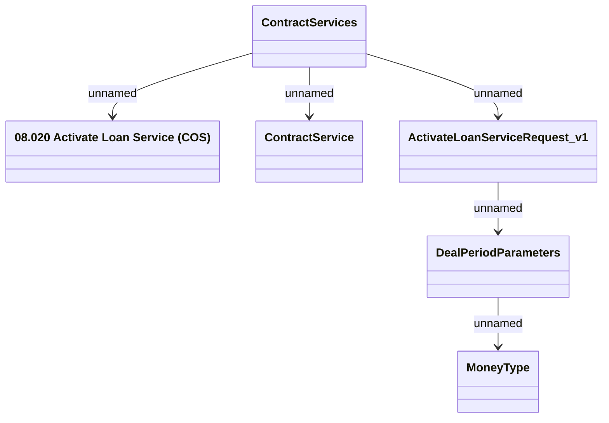

# Activate Loan Service method (COS) v1

```mermaid
classDiagram
    class MoneyType["MoneyType"]
    class n_08_020_Activate_Loan_Service_COS["08.020 Activate Loan Service (COS)"]
    class ContractService["ContractService"]
    class ActivateLoanServiceRequest_v1["ActivateLoanServiceRequest_v1"]
    class DealPeriodParameters["DealPeriodParameters"]
    class ContractServices["ContractServices"]
    ActivateLoanServiceRequest_v1 --> DealPeriodParameters : unnamed
    ContractServices --> ActivateLoanServiceRequest_v1 : unnamed
    ContractServices --> ContractService : unnamed
    ContractServices --> n_08_020_Activate_Loan_Service_COS : unnamed
    DealPeriodParameters --> MoneyType : unnamed
```
