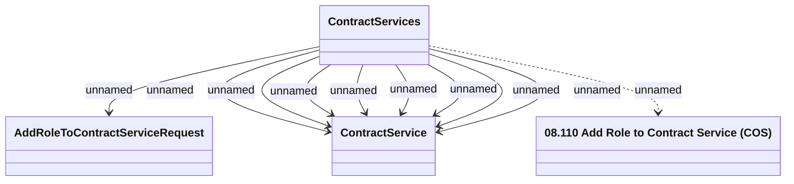

# Add Role to Contract Services method

- **Diagram Type**: Logical
- **Package**: HomerSelect/BSL/Modules/Contract Services (COS_NG)/Interface Provided/Web Services/Contract Services
- **Diagram ID**: 163480
- **Elements**: 4
- **Connectors**: 10

