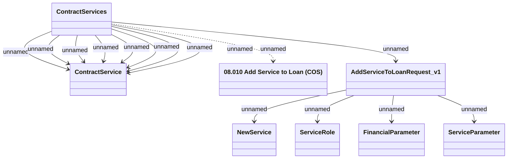

# Adding Loan Service to Contract method (COS) v1

- **Diagram Type**: Logical
- **Package**: HomerSelect/BSL/Modules/Contract Services (COS_NG)/Interface Provided/Web Services/Contract Services
- **Diagram ID**: 163483
- **Elements**: 8
- **Connectors**: 14

