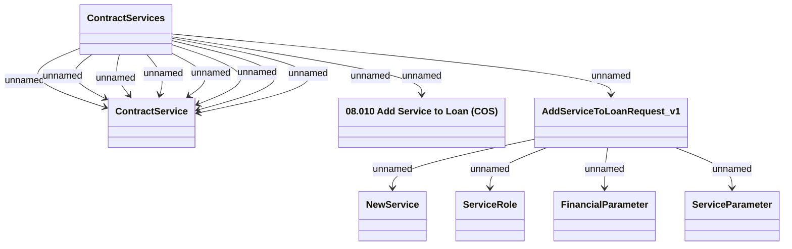

# Adding Loan Service to Contract method (COS) v1

```mermaid
classDiagram
    class ContractService["ContractService"]
    class n_08_010_Add_Service_to_Loan_COS["08.010 Add Service to Loan (COS)"]
    class ServiceParameter["ServiceParameter"]
    class FinancialParameter["FinancialParameter"]
    class ServiceRole["ServiceRole"]
    class NewService["NewService"]
    class AddServiceToLoanRequest_v1["AddServiceToLoanRequest_v1"]
    class ContractServices["ContractServices"]
    ContractServices --> AddServiceToLoanRequest_v1 : unnamed
    AddServiceToLoanRequest_v1 --> NewService : unnamed
    AddServiceToLoanRequest_v1 --> ServiceRole : unnamed
    AddServiceToLoanRequest_v1 --> FinancialParameter : unnamed
    AddServiceToLoanRequest_v1 --> ServiceParameter : unnamed
    ContractServices --> n_08_010_Add_Service_to_Loan_COS : unnamed
    ContractServices --> ContractService : unnamed
    ContractServices --> ContractService : unnamed
    ContractServices --> ContractService : unnamed
    ContractServices --> ContractService : unnamed
    ContractServices --> ContractService : unnamed
    ContractServices --> ContractService : unnamed
    ContractServices --> ContractService : unnamed
    ContractServices --> ContractService : unnamed
```
