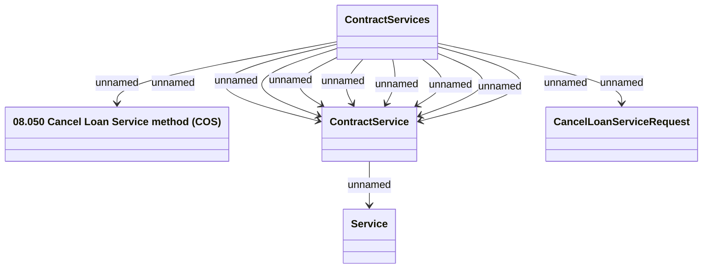

# Cancel Contract Services method (COS)

```mermaid
classDiagram
    class Service["Service"]
    class n_08_050_Cancel_Loan_Service_method_COS["08.050 Cancel Loan Service method (COS)"]
    class ContractService["ContractService"]
    class CancelLoanServiceRequest["CancelLoanServiceRequest"]
    class ContractServices["ContractServices"]
    ContractServices --> CancelLoanServiceRequest : unnamed
    ContractServices --> ContractService : unnamed
    ContractServices --> ContractService : unnamed
    ContractServices --> ContractService : unnamed
    ContractServices --> ContractService : unnamed
    ContractServices --> ContractService : unnamed
    ContractServices --> ContractService : unnamed
    ContractServices --> ContractService : unnamed
    ContractServices --> ContractService : unnamed
    ContractServices --> n_08_050_Cancel_Loan_Service_method_COS : unnamed
    ContractService --> Service : unnamed
```
