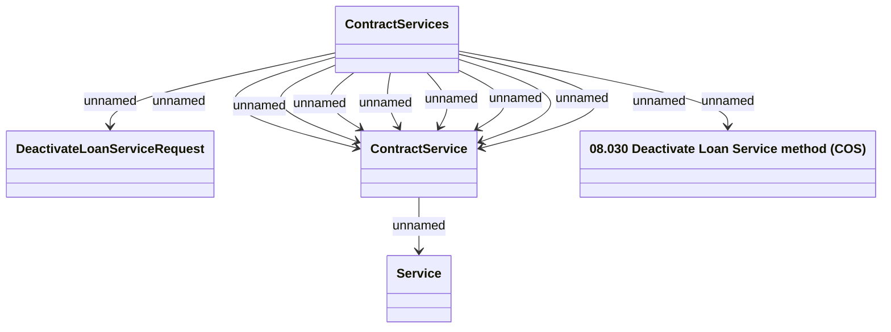

# Deactivate Contract Services method (COS)

```mermaid
classDiagram
    class Service["Service"]
    class DeactivateLoanServiceRequest["DeactivateLoanServiceRequest"]
    class ContractService["ContractService"]
    class n_08_030_Deactivate_Loan_Service_method_COS["08.030 Deactivate Loan Service method (COS)"]
    class ContractServices["ContractServices"]
    ContractServices --> n_08_030_Deactivate_Loan_Service_method_COS : unnamed
    ContractServices --> ContractService : unnamed
    ContractServices --> ContractService : unnamed
    ContractServices --> ContractService : unnamed
    ContractServices --> ContractService : unnamed
    ContractServices --> ContractService : unnamed
    ContractServices --> ContractService : unnamed
    ContractServices --> ContractService : unnamed
    ContractServices --> ContractService : unnamed
    ContractServices --> DeactivateLoanServiceRequest : unnamed
    ContractService --> Service : unnamed
```
