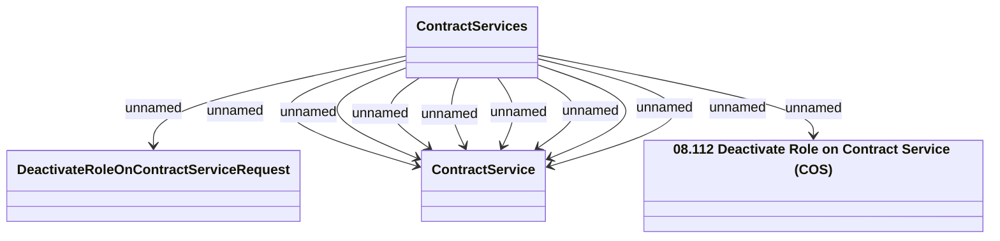

# Deactivate Role on Contract Services method

```mermaid
classDiagram
    class n_08_112_Deactivate_Role_on_Contract_Service_COS["08.112 Deactivate Role on Contract Service (COS)"]
    class ContractService["ContractService"]
    class DeactivateRoleOnContractServiceRequest["DeactivateRoleOnContractServiceRequest"]
    class ContractServices["ContractServices"]
    ContractServices --> DeactivateRoleOnContractServiceRequest : unnamed
    ContractServices --> ContractService : unnamed
    ContractServices --> ContractService : unnamed
    ContractServices --> ContractService : unnamed
    ContractServices --> ContractService : unnamed
    ContractServices --> ContractService : unnamed
    ContractServices --> ContractService : unnamed
    ContractServices --> ContractService : unnamed
    ContractServices --> ContractService : unnamed
    ContractServices --> n_08_112_Deactivate_Role_on_Contract_Service_COS : unnamed
```
