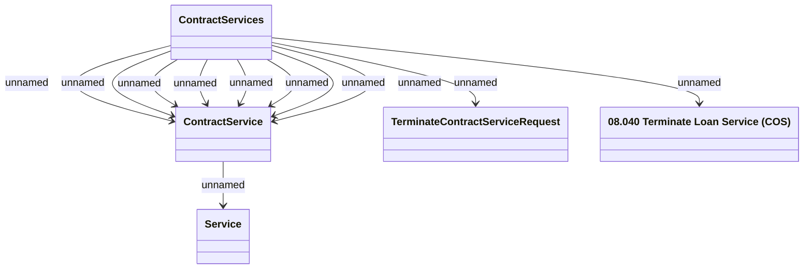

# Terminate Contract Service method (COS)

```mermaid
classDiagram
    class Service["Service"]
    class ContractService["ContractService"]
    class TerminateContractServiceRequest["TerminateContractServiceRequest"]
    class ContractServices["ContractServices"]
    class n_08_040_Terminate_Loan_Service_COS["08.040 Terminate Loan Service (COS)"]
    ContractServices --> n_08_040_Terminate_Loan_Service_COS : unnamed
    ContractServices --> TerminateContractServiceRequest : unnamed
    ContractServices --> ContractService : unnamed
    ContractServices --> ContractService : unnamed
    ContractServices --> ContractService : unnamed
    ContractServices --> ContractService : unnamed
    ContractServices --> ContractService : unnamed
    ContractServices --> ContractService : unnamed
    ContractServices --> ContractService : unnamed
    ContractServices --> ContractService : unnamed
    ContractService --> Service : unnamed
```
