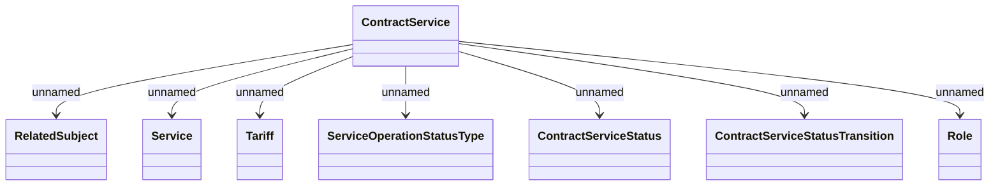

# Schema Definitions

```mermaid
classDiagram
    class Role["Role"]
    class ContractServiceStatusTransition["ContractServiceStatusTransition"]
    class ContractServiceStatus["ContractServiceStatus"]
    class ServiceOperationStatusType["ServiceOperationStatusType"]
    class Tariff["Tariff"]
    class Service["Service"]
    class RelatedSubject["RelatedSubject"]
    class ContractService["ContractService"]
    ContractService --> RelatedSubject : unnamed
    ContractService --> Service : unnamed
    ContractService --> Tariff : unnamed
    ContractService --> ServiceOperationStatusType : unnamed
    ContractService --> ContractServiceStatus : unnamed
    ContractService --> ContractServiceStatusTransition : unnamed
    ContractService --> Role : unnamed
```
