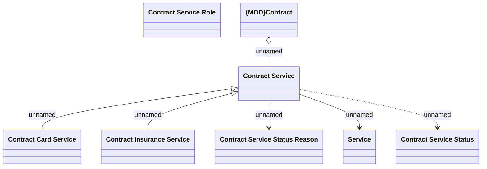

# COS - LDM changes

- **Diagram Type**: Logical
- **Package**: HomerSelect/BSL/Modules/Contract Services (COS_NG)/Requirement Model/CBL-22777 SME Project/COS/BSL - LDM changes
- **Diagram ID**: 160182
- **Elements**: 8
- **Connectors**: 6

