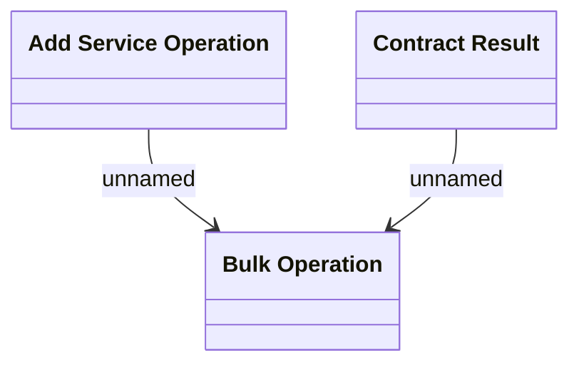

# Logical Data Model

```mermaid
classDiagram
    class Contract_Result["Contract Result"]
    class Add_Service_Operation["Add Service Operation"]
    class Bulk_Operation["Bulk Operation"]
    Add_Service_Operation --> Bulk_Operation : unnamed
    Contract_Result --> Bulk_Operation : unnamed
```
