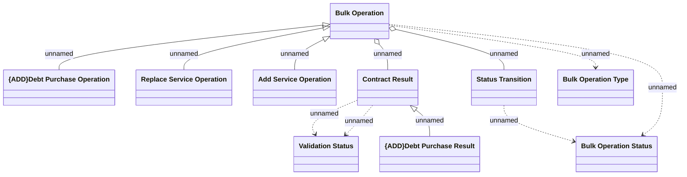

# COMMON Logical Data Model

- **Diagram Type**: Logical
- **Package**: HomerSelect/BSL/Modules/Contract bulk operations (BSA)/Analytical Model/COMMON for Contract Bulk Operations/Logical Data Model
- **Diagram ID**: 164413
- **Elements**: 10
- **Connectors**: 11

