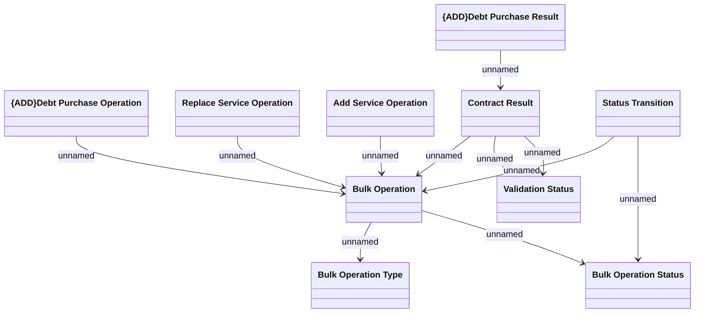

# COMMON Logical Data Model

```mermaid
classDiagram
    class ADD_Debt_Purchase_Result["{ADD}Debt Purchase Result"]
    class ADD_Debt_Purchase_Operation["{ADD}Debt Purchase Operation"]
    class Replace_Service_Operation["Replace Service Operation"]
    class Add_Service_Operation["Add Service Operation"]
    class Validation_Status["Validation Status"]
    class Contract_Result["Contract Result"]
    class Status_Transition["Status Transition"]
    class Bulk_Operation_Status["Bulk Operation Status"]
    class Bulk_Operation_Type["Bulk Operation Type"]
    class Bulk_Operation["Bulk Operation"]
    Replace_Service_Operation --> Bulk_Operation : unnamed
    Add_Service_Operation --> Bulk_Operation : unnamed
    Contract_Result --> Bulk_Operation : unnamed
    Status_Transition --> Bulk_Operation : unnamed
    Bulk_Operation --> Bulk_Operation_Type : unnamed
    Status_Transition --> Bulk_Operation_Status : unnamed
    Bulk_Operation --> Bulk_Operation_Status : unnamed
    Contract_Result --> Validation_Status : unnamed
    Contract_Result --> Validation_Status : unnamed
    ADD_Debt_Purchase_Operation --> Bulk_Operation : unnamed
    ADD_Debt_Purchase_Result --> Contract_Result : unnamed
```
