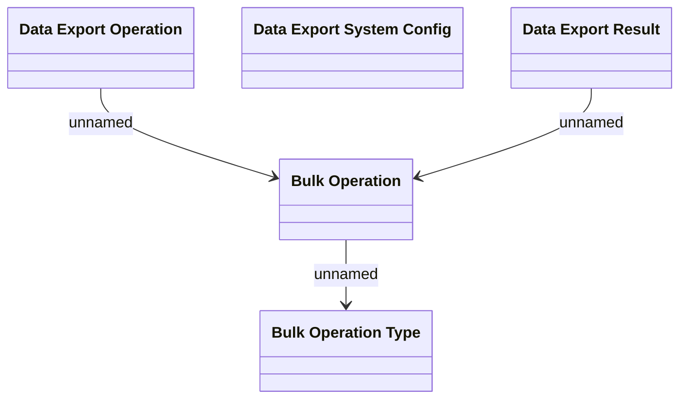

# Logical Data Model

```mermaid
classDiagram
    class Bulk_Operation_Type["Bulk Operation Type"]
    class Data_Export_Result["Data Export Result"]
    class Data_Export_System_Config["Data Export System Config"]
    class Data_Export_Operation["Data Export Operation"]
    class Bulk_Operation["Bulk Operation"]
    Data_Export_Operation --> Bulk_Operation : unnamed
    Bulk_Operation --> Bulk_Operation_Type : unnamed
    Data_Export_Result --> Bulk_Operation : unnamed
```
