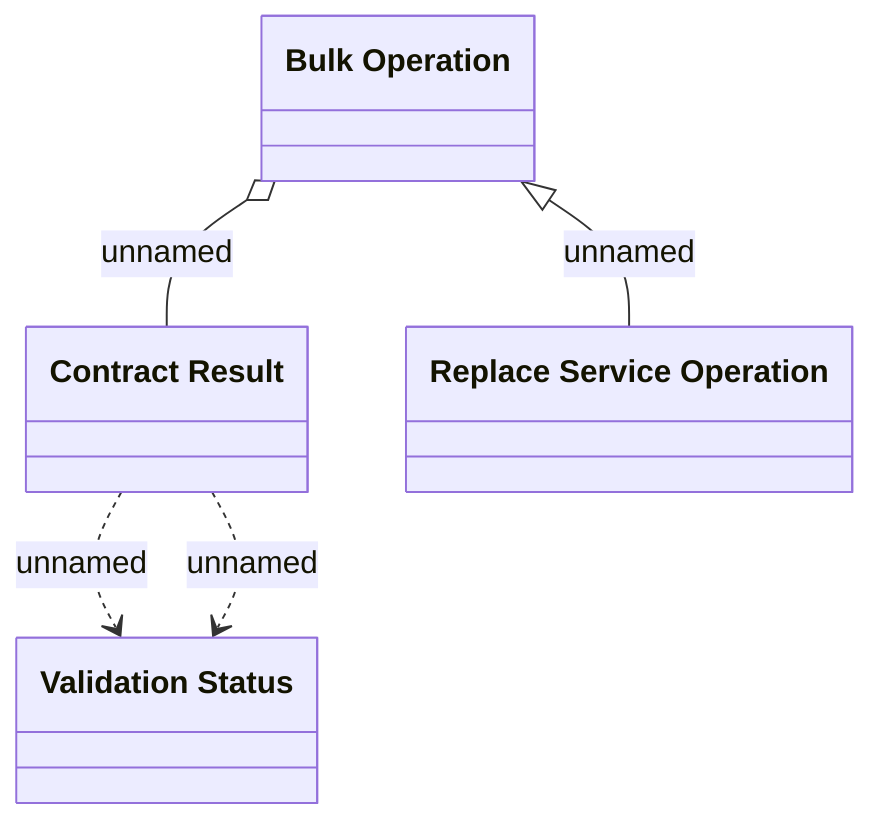

# Logical Data Model

- **Diagram Type**: Logical
- **Package**: HomerSelect/BSL/Modules/Contract bulk operations (BSA)/Analytical Model/Replace service/Logical Data Model
- **Diagram ID**: 164335
- **Elements**: 4
- **Connectors**: 4

