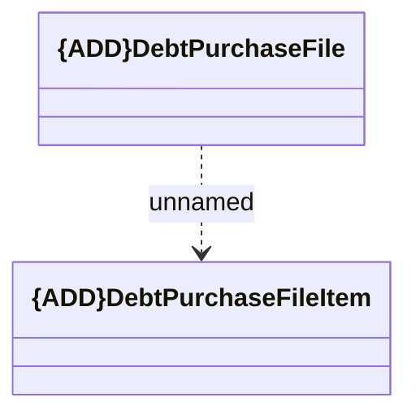

# Input file structure

- **Diagram Type**: Logical
- **Package**: HomerSelect/BSL/Modules/Contract bulk operations (BSA)/Analytical Model/{ADD}Debt Purchase/Logical Data Model
- **Diagram ID**: 164688
- **Elements**: 2
- **Connectors**: 1

