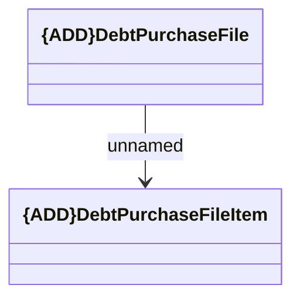

# Input file structure

```mermaid
classDiagram
    class ADD_DebtPurchaseFile["{ADD}DebtPurchaseFile"]
    class ADD_DebtPurchaseFileItem["{ADD}DebtPurchaseFileItem"]
    ADD_DebtPurchaseFile --> ADD_DebtPurchaseFileItem : unnamed
```
