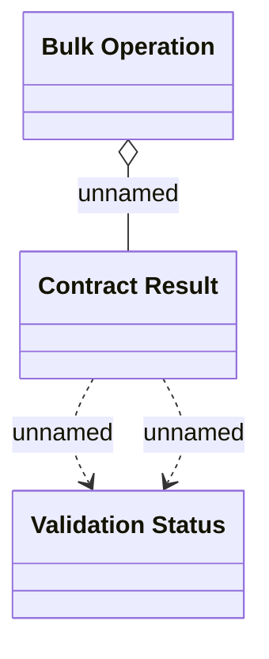

# Logical Data Model

- **Diagram Type**: Logical
- **Package**: HomerSelect/BSL/Modules/Contract bulk operations (BSA)/Analytical Model/{ADD}Migrated contract/Logical Data Model
- **Diagram ID**: 164656
- **Elements**: 3
- **Connectors**: 3

