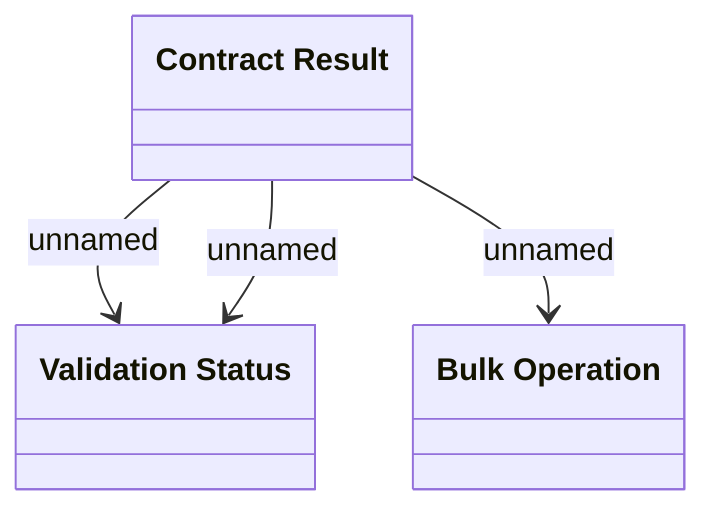

# Logical Data Model

```mermaid
classDiagram
    class Validation_Status["Validation Status"]
    class Contract_Result["Contract Result"]
    class Bulk_Operation["Bulk Operation"]
    Contract_Result --> Validation_Status : unnamed
    Contract_Result --> Validation_Status : unnamed
    Contract_Result --> Bulk_Operation : unnamed
```
