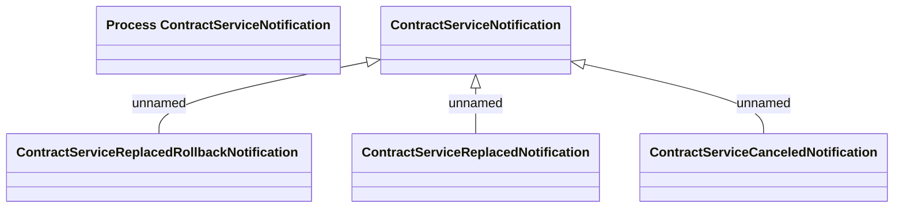

# Contract Service Notification

- **Diagram Type**: Logical
- **Package**: HomerSelect/BSL/Modules/Contract bulk operations (BSA)/Interface Consumed/RabbitMQ/COS/Contract Service Notification
- **Diagram ID**: 164420
- **Elements**: 5
- **Connectors**: 3

