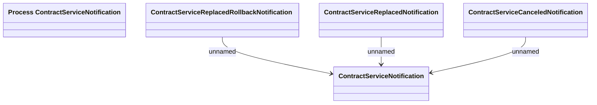

# Contract Service Notification

```mermaid
classDiagram
    class Process_ContractServiceNotification["Process ContractServiceNotification"]
    class ContractServiceReplacedRollbackNotification["ContractServiceReplacedRollbackNotification "]
    class ContractServiceReplacedNotification["ContractServiceReplacedNotification"]
    class ContractServiceCanceledNotification["ContractServiceCanceledNotification"]
    class ContractServiceNotification["ContractServiceNotification"]
    ContractServiceReplacedRollbackNotification --> ContractServiceNotification : unnamed
    ContractServiceReplacedNotification --> ContractServiceNotification : unnamed
    ContractServiceCanceledNotification --> ContractServiceNotification : unnamed
```
