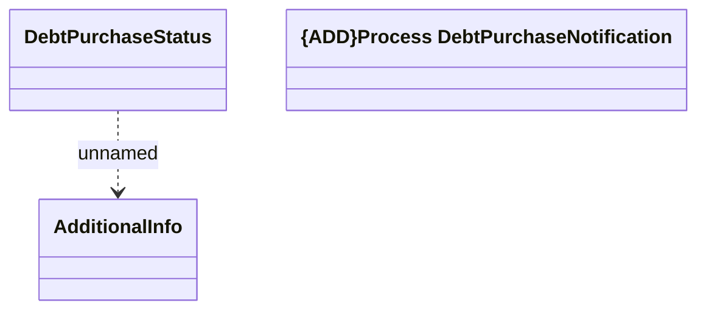

# Debt Purchase Notification

- **Diagram Type**: Logical
- **Package**: HomerSelect/BSL/Modules/Contract bulk operations (BSA)/Interface Consumed/RabbitMQ/Zeebe/Debt Purchase Notification
- **Diagram ID**: 164653
- **Elements**: 3
- **Connectors**: 1

