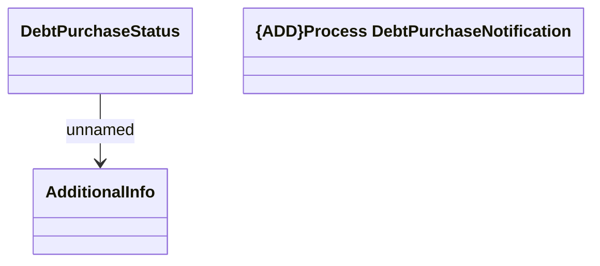

# Debt Purchase Notification

```mermaid
classDiagram
    class AdditionalInfo["AdditionalInfo"]
    class DebtPurchaseStatus["DebtPurchaseStatus"]
    class ADD_Process_DebtPurchaseNotification["{ADD}Process DebtPurchaseNotification"]
    DebtPurchaseStatus --> AdditionalInfo : unnamed
```
