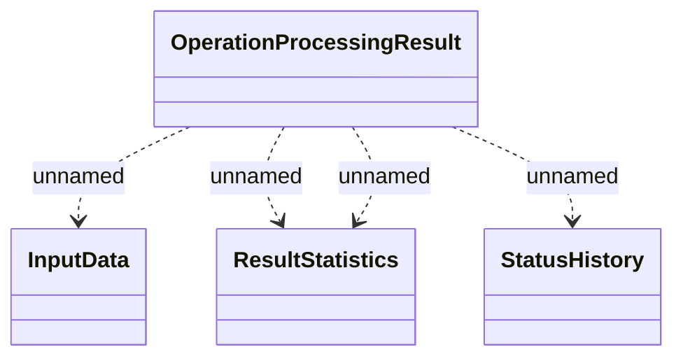

# csi.bsa.processing-result

- **Diagram Type**: Logical
- **Package**: HomerSelect/BSL/Modules/Contract bulk operations (BSA)/Interface Provided/Rabbit/csi.bsa.processing-result
- **Diagram ID**: 162571
- **Elements**: 4
- **Connectors**: 4

