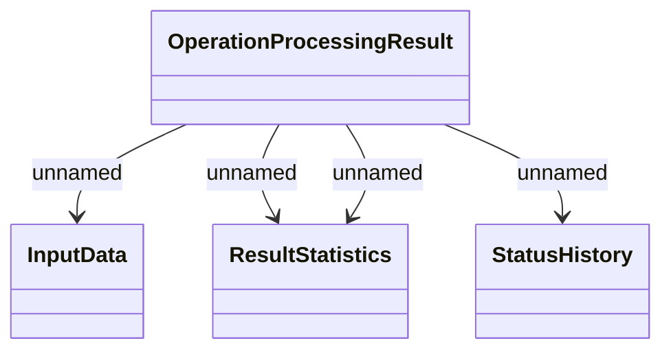

# csi.bsa.processing-result

```mermaid
classDiagram
    class InputData["InputData"]
    class StatusHistory["StatusHistory"]
    class ResultStatistics["ResultStatistics"]
    class OperationProcessingResult["OperationProcessingResult"]
    OperationProcessingResult --> InputData : unnamed
    OperationProcessingResult --> ResultStatistics : unnamed
    OperationProcessingResult --> ResultStatistics : unnamed
    OperationProcessingResult --> StatusHistory : unnamed
```
