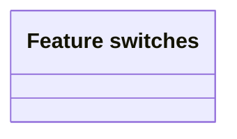

# Feature switches

- **Diagram Type**: Logical
- **Package**: HomerSelect/BSL/Modules/Debt catalogue/Analytical Model/Feature switches
- **Diagram ID**: 162211
- **Elements**: 1
- **Connectors**: 0

