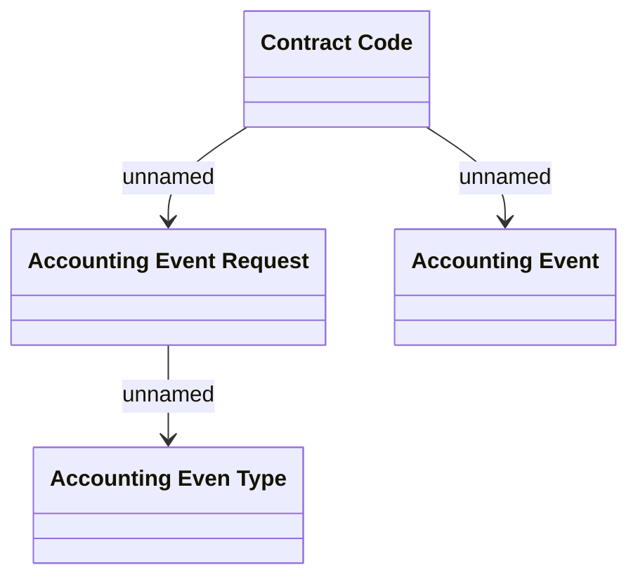

# Accounting Event

```mermaid
classDiagram
    class Contract_Code["Contract Code"]
    class Accounting_Event_Request["Accounting Event Request"]
    class Accounting_Even_Type["Accounting Even Type"]
    class Accounting_Event["Accounting Event"]
    Contract_Code --> Accounting_Event : unnamed
    Accounting_Event_Request --> Accounting_Even_Type : unnamed
    Contract_Code --> Accounting_Event_Request : unnamed
```
