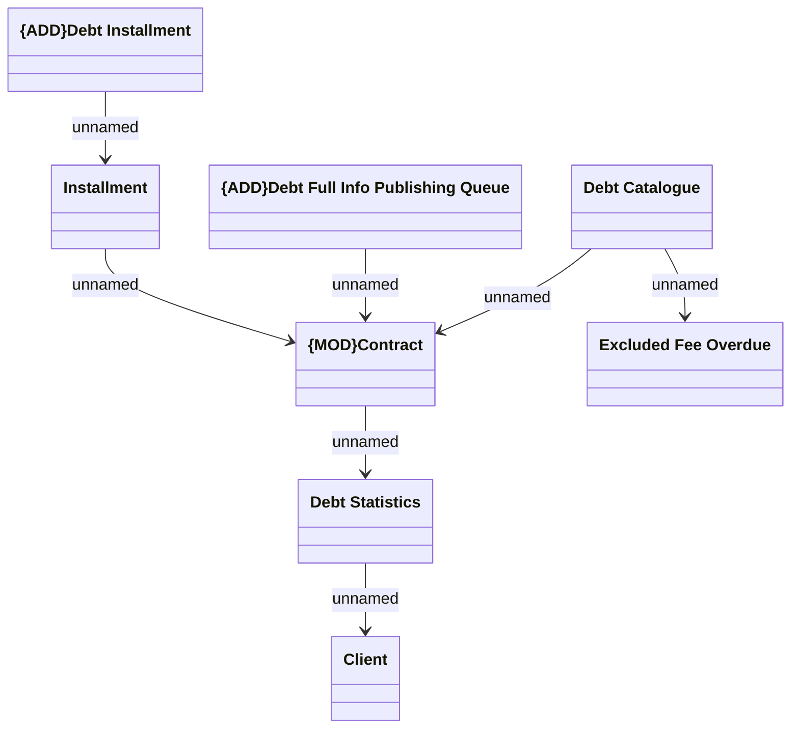

# Contract debt tracking

```mermaid
classDiagram
    class Installment["Installment"]
    class ADD_Debt_Installment["{ADD}Debt Installment"]
    class ADD_Debt_Full_Info_Publishing_Queue["{ADD}Debt Full Info Publishing Queue"]
    class Excluded_Fee_Overdue["Excluded Fee Overdue"]
    class Client["Client"]
    class Debt_Statistics["Debt Statistics"]
    class Debt_Catalogue["Debt Catalogue"]
    class MOD_Contract["{MOD}Contract"]
    ADD_Debt_Full_Info_Publishing_Queue --> MOD_Contract : unnamed
    Debt_Statistics --> Client : unnamed
    Debt_Catalogue --> Excluded_Fee_Overdue : unnamed
    ADD_Debt_Installment --> Installment : unnamed
    MOD_Contract --> Debt_Statistics : unnamed
    Debt_Catalogue --> MOD_Contract : unnamed
    Installment --> MOD_Contract : unnamed
```
