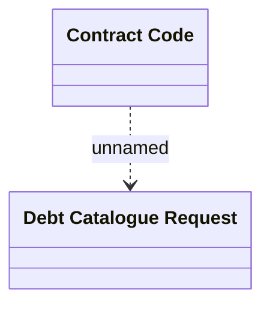

# Debt catalogue request

- **Diagram Type**: Logical
- **Package**: HomerSelect/BSL/Modules/Debt catalogue/Analytical Model/Logical Data Model
- **Diagram ID**: 164086
- **Elements**: 2
- **Connectors**: 1

