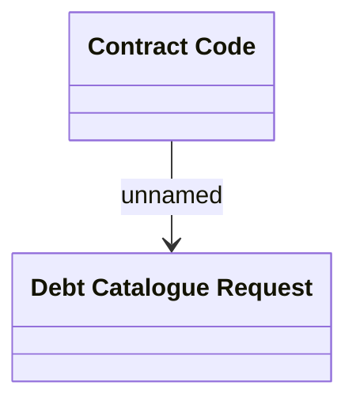

# Debt catalogue request

```mermaid
classDiagram
    class Debt_Catalogue_Request["Debt Catalogue Request"]
    class Contract_Code["Contract Code"]
    Contract_Code --> Debt_Catalogue_Request : unnamed
```
