# Mapping of AccountBalanceChange to Debt Catalog

- **Diagram Type**: Logical
- **Package**: HomerSelect/BSL/Modules/Debt catalogue/Analytical Model/Logical Data Model
- **Diagram ID**: 164084
- **Elements**: 2
- **Connectors**: 33

```mermaid
classDiagram
    class Debt_Catalogue["Debt Catalogue"]
    class AccountBalanceChangeDto["AccountBalanceChangeDto"]
    AccountBalanceChangeDto --> Debt_Catalogue : unnamed
    AccountBalanceChangeDto --> Debt_Catalogue : unnamed
    AccountBalanceChangeDto --> Debt_Catalogue : unnamed
    AccountBalanceChangeDto --> Debt_Catalogue : unnamed
    AccountBalanceChangeDto --> Debt_Catalogue : unnamed
    AccountBalanceChangeDto --> Debt_Catalogue : unnamed
    AccountBalanceChangeDto --> Debt_Catalogue : unnamed
    AccountBalanceChangeDto --> Debt_Catalogue : unnamed
    AccountBalanceChangeDto --> Debt_Catalogue : unnamed
    AccountBalanceChangeDto --> Debt_Catalogue : unnamed
    AccountBalanceChangeDto --> Debt_Catalogue : unnamed
    AccountBalanceChangeDto --> Debt_Catalogue : unnamed
    AccountBalanceChangeDto --> Debt_Catalogue : unnamed
    AccountBalanceChangeDto --> Debt_Catalogue : unnamed
    AccountBalanceChangeDto --> Debt_Catalogue : unnamed
    AccountBalanceChangeDto --> Debt_Catalogue : unnamed
    AccountBalanceChangeDto --> Debt_Catalogue : unnamed
    AccountBalanceChangeDto --> Debt_Catalogue : unnamed
    AccountBalanceChangeDto --> Debt_Catalogue : unnamed
    AccountBalanceChangeDto --> Debt_Catalogue : unnamed
    AccountBalanceChangeDto --> Debt_Catalogue : unnamed
    AccountBalanceChangeDto --> Debt_Catalogue : unnamed
    AccountBalanceChangeDto --> Debt_Catalogue : unnamed
    AccountBalanceChangeDto --> Debt_Catalogue : unnamed
    AccountBalanceChangeDto --> Debt_Catalogue : unnamed
    AccountBalanceChangeDto --> Debt_Catalogue : unnamed
    AccountBalanceChangeDto --> Debt_Catalogue : unnamed
    AccountBalanceChangeDto --> Debt_Catalogue : unnamed
    AccountBalanceChangeDto --> Debt_Catalogue : unnamed
    AccountBalanceChangeDto --> Debt_Catalogue : unnamed
    AccountBalanceChangeDto --> Debt_Catalogue : unnamed
    AccountBalanceChangeDto --> Debt_Catalogue : unnamed
    AccountBalanceChangeDto --> Debt_Catalogue : unnamed
```

