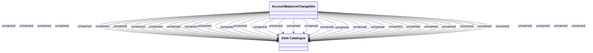

# Mapping of AccountBalanceChange to Debt Catalog

```mermaid
classDiagram
    class Debt_Catalogue["Debt Catalogue"]
    class AccountBalanceChangeDto["AccountBalanceChangeDto"]
    AccountBalanceChangeDto --> Debt_Catalogue : unnamed
    AccountBalanceChangeDto --> Debt_Catalogue : unnamed
    AccountBalanceChangeDto --> Debt_Catalogue : unnamed
    AccountBalanceChangeDto --> Debt_Catalogue : unnamed
    AccountBalanceChangeDto --> Debt_Catalogue : unnamed
    AccountBalanceChangeDto --> Debt_Catalogue : unnamed
    AccountBalanceChangeDto --> Debt_Catalogue : unnamed
    AccountBalanceChangeDto --> Debt_Catalogue : unnamed
    AccountBalanceChangeDto --> Debt_Catalogue : unnamed
    AccountBalanceChangeDto --> Debt_Catalogue : unnamed
    AccountBalanceChangeDto --> Debt_Catalogue : unnamed
    AccountBalanceChangeDto --> Debt_Catalogue : unnamed
    AccountBalanceChangeDto --> Debt_Catalogue : unnamed
    AccountBalanceChangeDto --> Debt_Catalogue : unnamed
    AccountBalanceChangeDto --> Debt_Catalogue : unnamed
    AccountBalanceChangeDto --> Debt_Catalogue : unnamed
    AccountBalanceChangeDto --> Debt_Catalogue : unnamed
    AccountBalanceChangeDto --> Debt_Catalogue : unnamed
    AccountBalanceChangeDto --> Debt_Catalogue : unnamed
    AccountBalanceChangeDto --> Debt_Catalogue : unnamed
    AccountBalanceChangeDto --> Debt_Catalogue : unnamed
    AccountBalanceChangeDto --> Debt_Catalogue : unnamed
    AccountBalanceChangeDto --> Debt_Catalogue : unnamed
    AccountBalanceChangeDto --> Debt_Catalogue : unnamed
    AccountBalanceChangeDto --> Debt_Catalogue : unnamed
    AccountBalanceChangeDto --> Debt_Catalogue : unnamed
    AccountBalanceChangeDto --> Debt_Catalogue : unnamed
    AccountBalanceChangeDto --> Debt_Catalogue : unnamed
    AccountBalanceChangeDto --> Debt_Catalogue : unnamed
    AccountBalanceChangeDto --> Debt_Catalogue : unnamed
    AccountBalanceChangeDto --> Debt_Catalogue : unnamed
    AccountBalanceChangeDto --> Debt_Catalogue : unnamed
    AccountBalanceChangeDto --> Debt_Catalogue : unnamed
```
