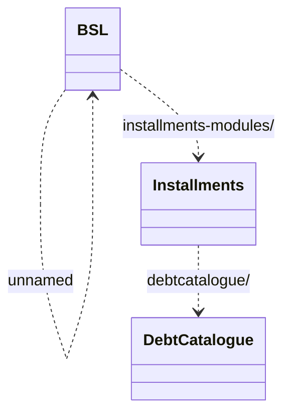

# BSL API

- **Diagram Type**: Logical
- **Package**: HomerSelect/BSL/Modules/Debt catalogue/Interface Consumed
- **Diagram ID**: 161230
- **Elements**: 4
- **Connectors**: 3

```mermaid
classDiagram
    class DebtCatalogue["DebtCatalogue"]
    class Installments["Installments"]
    class BSL["BSL"]
    class BSL["BSL"]
    BSL ..> BSL : unnamed
    BSL ..> Installments : installments-modules/
    Installments ..> DebtCatalogue : debtcatalogue/
```
