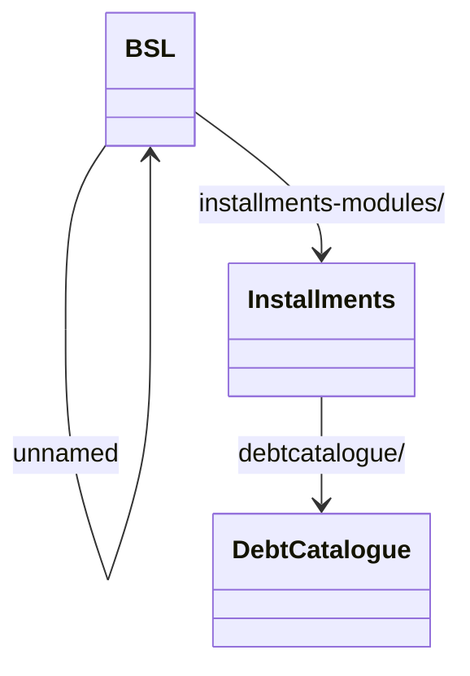

# BSL API

```mermaid
classDiagram
    class DebtCatalogue["DebtCatalogue"]
    class Installments["Installments"]
    class BSL["BSL"]
    class BSL["BSL"]
    BSL --> BSL : unnamed
    BSL --> Installments : installments-modules/
    Installments --> DebtCatalogue : debtcatalogue/
```
